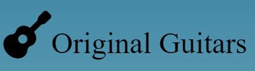
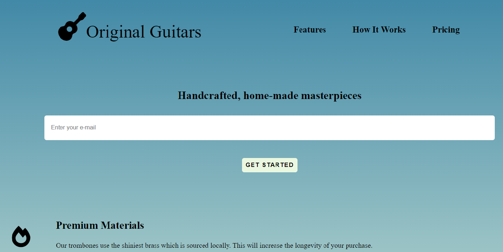

## 

## Guitar Landing Page
* The Landing-Page project from FreeCodeCamp Front-end Challenge.
* Developed first with the Mobile First methodology, then for desktop.
* Compatible with all mobile devices and with a beautiful and pleasant user interface.

## Technology 

Here are the technologies used in this project.

* HTML5
* CSS3

## Services Used

* Github
* Netlify
* Font Awesome

## Links
  - Deploy on Netlify: https://guitarlandingpage.netlify.app/
  - Repository: https://github.com/decobaccili/Guitar_Landing_Page

## Versioning

  1.0.0.0

## Authors

  * **André Baccili** 

  Please follow github and join us!
  Thanks to visiting me and good coding!

  
